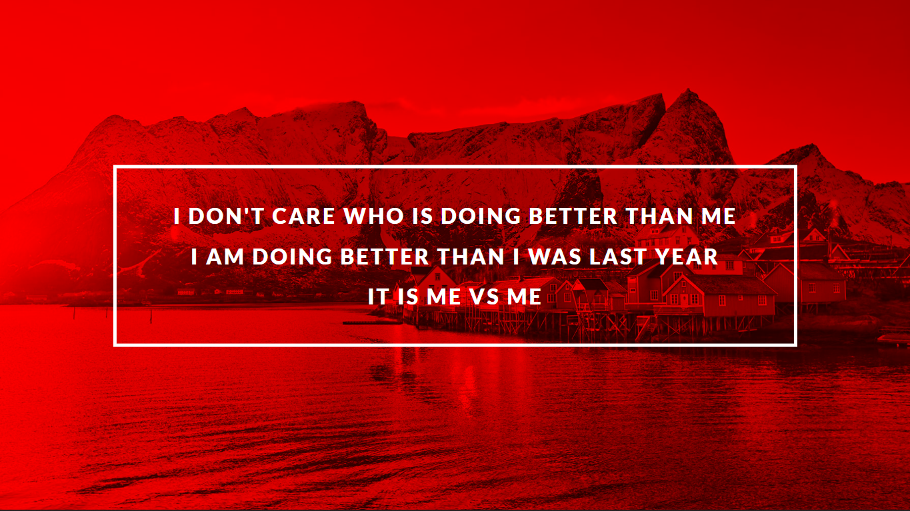

# Soal No. 3 LC 3 

### RESTRICTION

- Dilarang membuat element baru atau mengubah element yang sudah ada pada file HTML.
- Dilarang menambahkan styling baru atau mengubah styling sudah ada pada file CSS.
- Cukup gunakan code pada file yang sudah disediakan.

## Directions

Disini kamu akan menstlying sebuah halaman html dengan menggunakan css yang keduanya sudah disediakan.
Untuk contoh yang diharapkan silahkan lihat contoh di bagian example.

## Example
