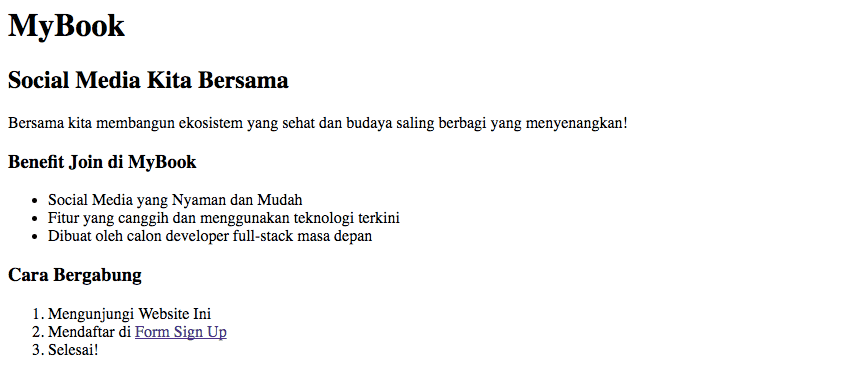
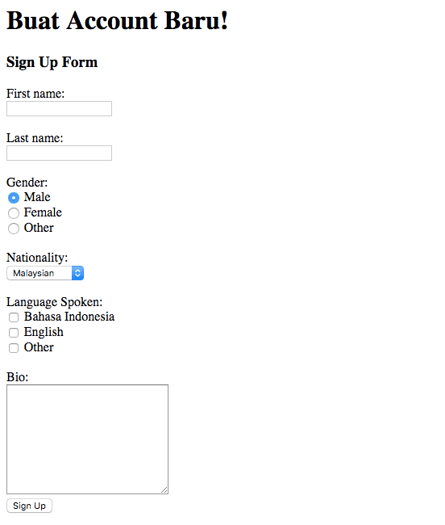
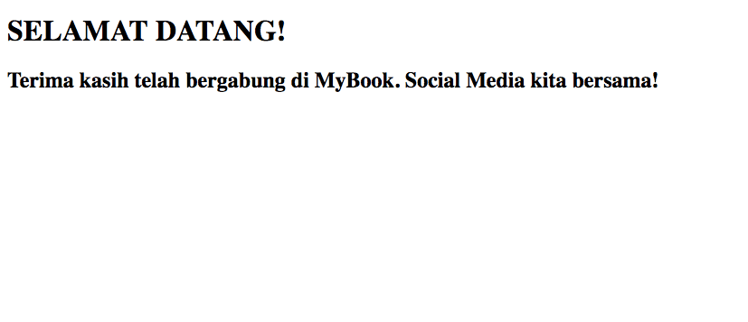
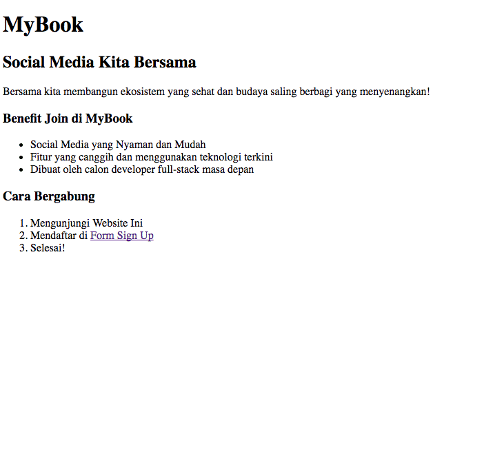

# Rocket-Membuat-Halaman-HTML-Sederhana

## Objectives
Setelah mempelajari dasar-dasar HTML, kamu ditantang untuk membuat sebuah laman html sendiri menggunakan tags yang telah kamu pelajari. Laman pertama ini akan digunakan untuk tugas-tugas selanjutnya, pastikan kamu mengerjakannya dengan baik.

## Directions
1. Membuat File HTML - Index Page

   Buatlah sebuah file HTML baru dengan nama **index** dengan format **html**.

   [Kenapa harus index.html ?](https://www.quora.com/Why-is-the-default-html-file-called-index-html)

   Buatlah _index.html_ tersebut dengan tampilan seperti gambar di bawah ini:

   
   Berikan sebuah link untuk masuk ke halaman Form Sign Up! (diarahkan ke form.html)

2. Membuat File HTML ke 2 - Form Page

   Buatlah file HTML kedua yang berisikan form dengan tampilan seperti gambar di bawah ini:

   

   Apabila form di submit, browser harus diarahkan untuk membuka _welcome.html_.

3. Membuat File HTML ke 3 - Welcome Page
   
   Buatlah file HTML ketiga bernama welcome.html dengan tampilan seperti gambar di bawah ini:

   

4. Hasil Akhir

   Apabila seluruh tautan/link telah berfungsi dengan baik, harusnya web telah bekerja seperti berikut, jika dibuka dari _index.html_.

   
