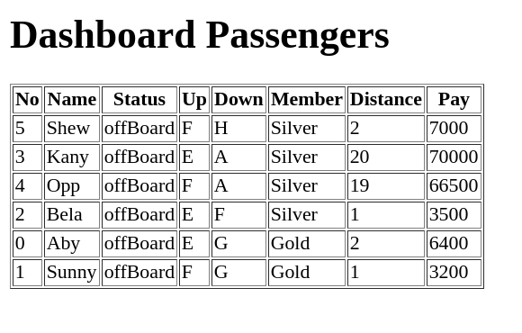

# `Passenger`

## `NOTES`

- Jalankan `npm install` terlebih dahulu
- Pada skeleton terdapat folder `__tests__`, folder ini beserta file-file di dalamnya tidak boleh diubah sama sekali.
- untuk menjalankan test untuk memastikan solusi kamu sudah benar, jalankan command `npm test`

## `RESTRICTION`

- Hanya boleh menggunakan built-in function untuk menambahkan atau mengurangi data dalam array, seperti `shift()`, `unShift()`, `push()`, dan `pop()`
- Tidak boleh menggunakan `forEach`, `for...of`, ataupun `map`, dan `every`

## `HINT`

- Nama function haruslah `getPassengers`, `getDistance`, `paymentInfo`, `getDropped`,
dan `transportation` dan __tidak boleh diganti dengan nama function lainnya__. Untuk detail fungsi akan mengacu kepada [Directions](##directions) yang disebutkan di bawah
- Jangan menghapus, comment ataupun mengedit bagian module.exports dibagian bawah
- Kerjakan solusi kamu pada file `index.js` terlebih dahulu.

---

## `Objective`

- mampu memecahkan masalah yang diberikan
- mampu mengakses array multidimensi dan array of object
- mampu membuat object serta object multi dimensi
- mampu membuat array serta array multi dimensi
- mengerti melempar atau memasukkan data hasil menjadi parameter function lainnya
- mampu mengimplementasikan DOM


## `Directions`

Pada soal ini kalian diberikan function `transportation` yang menjadi function utama. 

function ini menerima 1 buah parameter.
  - parameter merupakan sebuah array yang index pertamanya berisi string berupa kota berangkat, sedangkan index selanjutnya berisi array of string yang berisi informasi yang dipisahkan oleh "," dengan format: <br>
    `"<name>,<status>,<up>,<land>,<member>"`

Dalam mengerjakan solusi untuk function `transportation` ini, kalian akan memecah function `transportation` menjadi beberapa bagian. perhatikan beberapa release yang diberikan!

<br>

### `Release 1 - getPassengers(psg)`
pada function ini kalian harus mengubah data dengan format array menjadi array of object.
```js
function getPassengers(psg){
  // your code here
}

let input = [
  "Aby,offBoard,H,G,Gold",
  "Bela,offBoard,H,F,Silver",
  "Kany,offBoard,H,U,Silver",
  "Sunny,offBoard,J,G,Gold",
  "Shew,offBoard,J,H,Silver",
  "Opp,offBoard,J,U,Silver"
]

console.log(getPassengers(input))
/* 
[
  {
    name: 'Aby',
    status: 'offBoard',
    up: 'H',
    land: 'G',
    member: 'Gold'
  },
  {
    name: 'Bela',
    status: 'offBoard',
    up: 'H',
    land: 'F',
    member: 'Silver'
  },
  {
    name: 'Kany',
    status: 'offBoard',
    up: 'H',
    land: 'U',
    member: 'Silver'
  },
  {
    name: 'Sunny',
    status: 'offBoard',
    up: 'J',
    land: 'G',
    member: 'Gold'
  },
  {
    name: 'Shew',
    status: 'offBoard',
    up: 'J',
    land: 'H',
    member: 'Silver'
  },
  {
    name: 'Opp',
    status: 'offBoard',
    up: 'J',
    land: 'U',
    member: 'Silver'
  }
]
*/
```

<br>

### `Release 2 - getDistance(psg)`
Pada function ini kalian akan mencari tahu berapa jarak dari kota naik (`up`) sampai kota turun (`land`).
Dalam kota turun selalu setelah kota naik (tidak mundur kebelakang).
> misal kota naik => `D` maka kota turun tidak bisa `A`, `B`, `C`. Jadi harus setelahnya yaitu antara `D` sampai `X`
Disini akan membuat key baru dari object input di paramter psg yang berisi _number_. Setiap melewati satu kota maka dianggap 1 untuk distancenya.
Untuk daftar kota sudah disediakan dalam function. (dari kota `A` sampai kota `X`)

```js
function getDistance(psg){
  const city = "ABCDEFGHIJKLMNOPQRSTUVWX"
  // your code here
}

console.log(getDistance([
  { name: 'Aby', status: 'offBoard', up: 'E', land: 'G', member: 'Gold' },
  { name: 'Bela', status: 'offBoard', up: 'E', land: 'F', member: 'Silver' },
  { name: 'Kany', status: 'offBoard', up: 'E', land: 'S', member: 'Silver' },
  { name: 'Sunny', status: 'offBoard', up: 'F', land: 'G', member: 'Gold' },
  { name: 'Shew', status: 'offBoard', up: 'F', land: 'H', member: 'Silver' },
  { name: 'Opp', status: 'offBoard', up: 'F', land: 'U', member: 'Silver' }
]))
/**
[
  {
    name: 'Aby',
    status: 'offBoard',
    up: 'E',
    land: 'G',
    member: 'Gold',
    distance: 2
  },
  {
    name: 'Bela',
    status: 'offBoard',
    up: 'E',
    land: 'F',
    member: 'Silver',
    distance: 1
  },
  {
    name: 'Kany',
    status: 'offBoard',
    up: 'E',
    land: 'S',
    member: 'Silver',
    distance: 14
  },
  {
    name: 'Sunny',
    status: 'offBoard',
    up: 'F',
    land: 'G',
    member: 'Gold',
    distance: 1
  },
  {
    name: 'Shew',
    status: 'offBoard',
    up: 'F',
    land: 'H',
    member: 'Silver',
    distance: 2
  },
  {
    name: 'Opp',
    status: 'offBoard',
    up: 'F',
    land: 'U',
    member: 'Silver',
    distance: 15
  }
]
*/
```

<br>

### `Release 3 - paymentInfo(psg)`
pada function ini kalian diminta untuk menghitung berapa biaya yang akan dikenakan setiap penumpang. informasi diberikan dengan property baru bernama **pay** (_number_).
  Setiap penumpang memiliki harga yang berbeda-beda.
   - member Lite akan membayar 3800 setiap melewati 1 kota (city)
   - member Silver akan membayar 3500 setiap melewati 1 kota (city)
   - member Gold akan membayar 3200 setiap melewati 1 kota (city)
  mis.
  A - C member Gold, dengan distance 2 maka biaya yang dikenakan adalah 6400

```js
function paymentInfo(psg){
  // your code here
}
let input = [
  { name: 'Aby', status: 'offBoard', up: 'E', land: 'G', member: 'Gold', distance: 2 },
  { name: 'Bela', status: 'offBoard', up: 'E', land: 'F', member: 'Silver', distance: 1 },
  { name: 'Kany', status: 'offBoard', up: 'E', land: 'S', member: 'Silver', distance: 14 },
  { name: 'Sunny', status: 'offBoard', up: 'F', land: 'G', member: 'Gold', distance: 1 },
  { name: 'Shew', status: 'offBoard', up: 'F', land: 'H', member: 'Silver', distance: 2 },
  { name: 'Opp', status: 'offBoard', up: 'F', land: 'U', member: 'Silver', distance: 19 }
]
console.log(paymentInfo(input)) 
/**
[
  {
    name: 'Aby',
    status: 'offBoard',
    up: 'E',
    land: 'G',
    member: 'Gold',
    distance: 2,
    pay: 6400
  },
  {
    name: 'Bela',
    status: 'offBoard',
    up: 'E',
    land: 'F',
    member: 'Silver',
    distance: 1,
    pay: 3500
  },
  {
    name: 'Kany',
    status: 'offBoard',
    up: 'E',
    land: 'S',
    member: 'Silver',
    distance: 14,
    pay: 49000
  },
  {
    name: 'Sunny',
    status: 'offBoard',
    up: 'F',
    land: 'G',
    member: 'Gold',
    distance: 1,
    pay: 3200
  },
  {
    name: 'Shew',
    status: 'offBoard',
    up: 'F',
    land: 'H',
    member: 'Silver',
    distance: 2,
    pay: 7000
  },
  {
    name: 'Opp',
    status: 'offBoard',
    up: 'F',
    land: 'U',
    member: 'Silver',
    distance: 19,
    pay: 66500
  }
]
*/
```

<br>

### `Release 4 - getDropped(psg)`
Pada function ini kamu diminta memfilter deduai dengan kota tujuan atau _land_ nya, dimana outputnya berbentuk object yang memiliki key kota tujuan dan value array semua orang yang bertujuan ke kota tersebut.


```js
function getDropped(psg){
  // your code here
}
let input = [
  { name: 'Aby', status: 'offBoard', up: 'E', land: 'G', member: 'Gold', distance: 2, pay: 6400 },
  { name: 'Bela', status: 'offBoard', up: 'E', land: 'F', member: 'Silver', distance: 1, pay: 3500 },
  { name: 'Kany', status: 'offBoard', up: 'E', land: 'S', member: 'Silver', distance: 14, pay: 49000 },
  { name: 'Sunny', status: 'offBoard', up: 'F', land: 'G', member: 'Gold', distance: 1, pay: 3200 },
  { name: 'Shew', status: 'offBoard', up: 'F', land: 'H', member: 'Silver', distance: 2, pay: 7000 },
  { name: 'Opp', status: 'offBoard', up: 'F', land: 'U', member: 'Silver', distance: 19, pay: 66500 }
]
console.log(getDropped(input))
/*
{
  G: [
    {
      name: 'Aby',
      status: 'offBoard',
      up: 'E',
      land: 'G',
      member: 'Gold',
      distance: 2,
      pay: 6400
    },
    {
      name: 'Sunny',
      status: 'offBoard',
      up: 'F',
      land: 'G',
      member: 'Gold',
      distance: 1,
      pay: 3200
    }
  ],
  F: [
    {
      name: 'Bela',
      status: 'offBoard',
      up: 'E',
      land: 'F',
      member: 'Silver',
      distance: 1,
      pay: 3500
    }
  ],
  S: [
    {
      name: 'Kany',
      status: 'offBoard',
      up: 'E',
      land: 'S',
      member: 'Silver',
      distance: 14,
      pay: 49000
    }
  ],
  H: [
    {
      name: 'Shew',
      status: 'offBoard',
      up: 'F',
      land: 'H',
      member: 'Silver',
      distance: 2,
      pay: 7000
    }
  ],
  U: [
    {
      name: 'Opp',
      status: 'offBoard',
      up: 'F',
      land: 'U',
      member: 'Silver',
      distance: 19,
      pay: 66500
    }
  ]
}
*/
```

### `Release 5 - transportation(input)`
sekarang kalian masuk ke tahap akhir yaitu function `transportation`. Tugas kalian adalah memproses data yang diberikan sebagai parameter menjadi sebuah object yang setiap objectnya memiliki key kota tujuan yang valuenya berupa array dengan isi semua penumpang yang termasuk ke tujuan tersebut. **Manfaatkan function - function yang sudah kalian kerjakan sebelumnya didalam function `transportation` ini.**


```js
function transportation(input)){
  // your code here
}

let input = [
  "Aby,offBoard,E,G,Gold",
  "Bela,offBoard,E,F,Silver",
  "Kany,offBoard,E,S,Silver",
  "Sunny,offBoard,F,G,Gold",
  "Shew,offBoard,F,H,Silver",
  "Opp,offBoard,F,U,Silver"
]

console.log(transportation(input))
/* {
  G: [
    {
      name: 'Aby',
      status: 'offBoard',
      up: 'E',
      land: 'G',
      member: 'Gold',
      distance: 2,
      pay: 6400
    },
    {
      name: 'Sunny',
      status: 'offBoard',
      up: 'F',
      land: 'G',
      member: 'Gold',
      distance: 1,
      pay: 3200
    }
  ],
  F: [
    {
      name: 'Bela',
      status: 'offBoard',
      up: 'E',
      land: 'F',
      member: 'Silver',
      distance: 1,
      pay: 3500
    }
  ],
  S: [
    {
      name: 'Kany',
      status: 'offBoard',
      up: 'E',
      land: 'S',
      member: 'Silver',
      distance: 14,
      pay: 49000
    }
  ],
  H: [
    {
      name: 'Shew',
      status: 'offBoard',
      up: 'F',
      land: 'H',
      member: 'Silver',
      distance: 2,
      pay: 7000
    }
  ],
  U: [
    {
      name: 'Opp',
      status: 'offBoard',
      up: 'F',
      land: 'U',
      member: 'Silver',
      distance: 15,
      pay: 52500
    }
  ]
} */
```

<br>

### `Release 6 - Put it in HTML`
Tugas kalian pada release 6 ini adalah menampilkan hasil dari function `transportation` kedalam bentuk table HTML. <br>
**Kerjakan release 6 pada file `script.js`**
Perhatikan contoh pada gambar berikut:

<p align="center">
  
</p>


<br>
Buatlah implementasi JavaScript-nya!
___